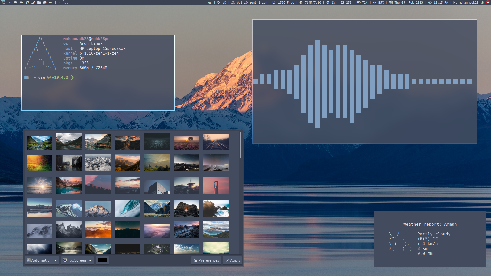

# Pixelfiles

My Configs for Archlinux, DWM, St, Dmenu, qutebrowser and more !! :D



---

## Repositories
1. [DWM Build](https://github.com/mohannadk28/dwm-pixelfiles)
2. [St Build](https://github.com/mohannadk28/st-pixelfiles)
3. [Dmenu Build](https://github.com/mohannadk28/dmenu-pixelfiles)
4. [DWMBlocks Build](https://github.com/mohannadk28/dwmblocks-pixelfiles)
5. [SXIV Build](https://github.com/mohannadk28/sxiv-pixelfiles)
6. [Neovim Config](https://github.com/mohannadk28/nvim-pixelfiles)
7. [Wallpapers](https://github.com/mohannadk28/wallpapers-pixelfiles)
8. [Dotfiles](https://github.com/mohannadk28/dotfiles-pixelfiles)
9. [Scripts](https://github.com/mohannadk28/scripts-pixelfiles)
10. [Sounds](https://github.com/mohannadk28/sounds-pixelfiles)

---

## Note for Artix Users

you will have to enable the Arch Linux Repos for This Script to work if you didn't enable The Arch Repos Some Packages will not install therefor the Installation process will fail

---

## Installation

to install Pixelfiles You will have to:-
1. Clone the pixelfiles Repo
```sh
git clone https://github.com/mohannadk28/pixelfiles
```
2. Run the `pf` script
```sh
./pf
```
3. reboot
4. Congrats You Installed Pixelfiles :D

---

## Inspration

This project was Highly Inspired by [DTOS](https://gitlab.com/dtos/dtos)

